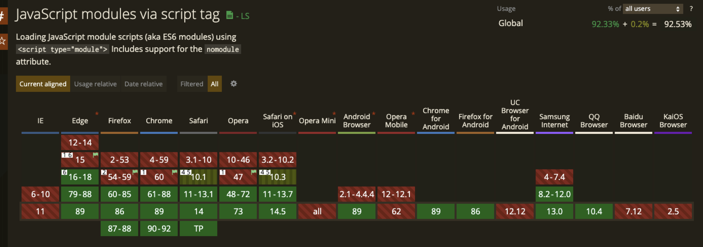
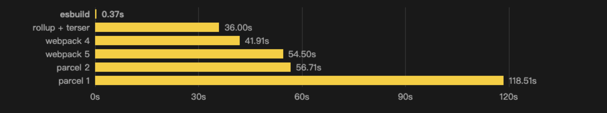
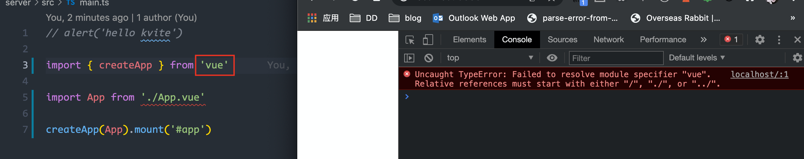
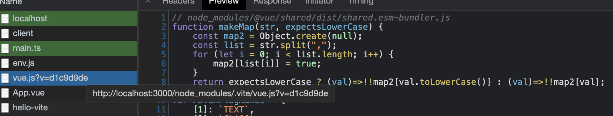
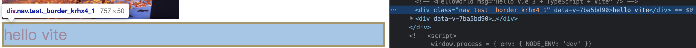
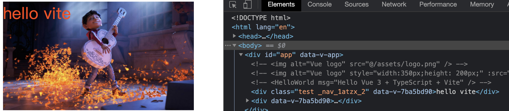
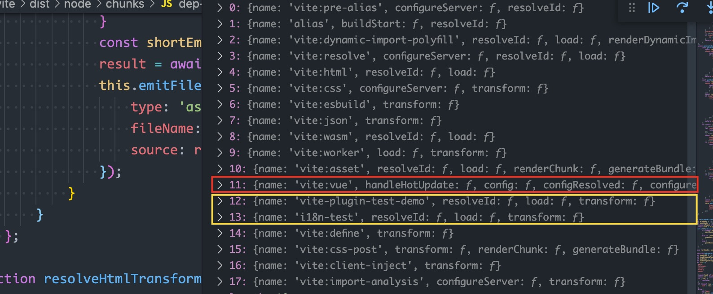
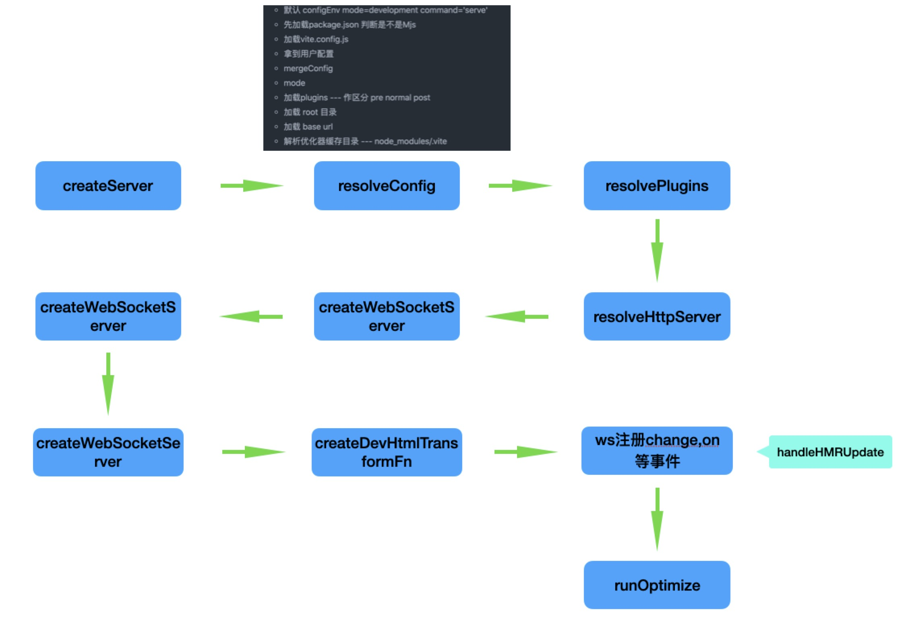

<!-- START doctoc generated TOC please keep comment here to allow auto update -->
<!-- DON'T EDIT THIS SECTION, INSTEAD RE-RUN doctoc TO UPDATE -->
**Table of Contents**  *generated with [DocToc](https://github.com/thlorenz/doctoc)*

- [Vite](#vite)
  - [背景](#%E8%83%8C%E6%99%AF)
  - [特点](#%E7%89%B9%E7%82%B9)
  - [部分功能介绍](#%E9%83%A8%E5%88%86%E5%8A%9F%E8%83%BD%E4%BB%8B%E7%BB%8D)
    - [预编译](#%E9%A2%84%E7%BC%96%E8%AF%91)
    - [依赖解析](#%E4%BE%9D%E8%B5%96%E8%A7%A3%E6%9E%90)
    - [CSS modules](#css-modules)
    - [HMR](#hmr)
  - [插件](#%E6%8F%92%E4%BB%B6)
    - [Vite 插件钩子](#vite-%E6%8F%92%E4%BB%B6%E9%92%A9%E5%AD%90)
    - [插件常用钩子](#%E6%8F%92%E4%BB%B6%E5%B8%B8%E7%94%A8%E9%92%A9%E5%AD%90)
  - [启动流程总结](#%E5%90%AF%E5%8A%A8%E6%B5%81%E7%A8%8B%E6%80%BB%E7%BB%93)
  - [简易插件DEMO](#%E7%AE%80%E6%98%93%E6%8F%92%E4%BB%B6demo)

<!-- END doctoc generated TOC please keep comment here to allow auto update -->

# Vite

Vite (French word for "fast", pronounced /vit/) is a new breed of frontend build tool that significantly improves the frontend development experience.  [中文官网](https://cn.vitejs.dev) | [英文官网](https://vitejs.dev)

> 基于浏览器原生ES模块的前端构建工具

## 背景

基于打包器的开发服务器


基于 ESM 的开发服务器


在开发服务器环境下：

- 缓慢的服务器启动：构建打包耗时严重，模块越多，打包时间就越长

- 缓慢的更新：较少代码的更新会导致依赖模块全部更新，导致页面更新慢

目前主流的浏览器大部分都已经支持ES模块（支持原生趋势）：



## 特点

**原生ES模块**
> Vite 需要在支持原生ES模块动态导入的浏览器中使用

**按需编译**
> Vite将应用程序中的模块划分为两类：依赖项和源代码，代码只在需要的时候进行编译

**Dev Serve即时启动**
> 开发服务器启动后不需要进行打包操作，启动会变得非常迅速

**几乎实时的模块热更新**
> 只更新修改的文件

**开箱即用**
> 提供了对 .scss, .sass, .less, .styl 和 .stylus 文件的内置支持，只需要安装相应的预处理器依赖，不需要为其安装特定的插件

## 部分功能介绍

### 预编译

使用esbuild对检测到的依赖进行预构建



### 依赖解析

在浏览器环境中，无法获取导入的模块内容，只能通过相对路径或者绝对路径去寻找模块。



模块路径重写
vite/packages/vite/src/node/plugins/importAnalysis.ts 中的 importAnalysisPlugin 插件



基于Koa实现的简单模块解析
```js
if (url === '/') {
    // 首页
    const filePath = path.resolve(__dirname, 'index.html')
    // console.log(filePath)
    ctx.type = 'text/html'
    ctx.body = fs.readFileSync(filePath, 'utf8')
  } else if (url.endsWith('.ts')) {
    // 响应js请求
    const p = path.join(__dirname, url)
    ctx.type = 'text/javascript'
    // const file = rewriteImport(fs.readFileSync(p, 'utf8'))
    const file = fs.readFileSync(p, 'utf8')
    ctx.body = file
  } else if (url.startsWith('/@modules/')) {
    // 获取 @modules 后面的模块名称
    const moduleName = url.replace('/@modules/', '')
    const moduleRootPath = path.join(__dirname, '../node_modules', moduleName)
    // 要加载文件的地址
    const modulePath = require(moduleRootPath + '/package.json').module
    const filePath = path.join(moduleRootPath, modulePath)
    const res = fs.readFileSync(filePath, 'utf8')
    ctx.type = 'text/javascript'
    ctx.body = rewriteImport(res)
  } else if (url.indexOf('.vue') > -1) {
    // 读取vue文件内容
    const p = path.join(__dirname, url.split('?')[0])
    // compilerSFC 解析 SFC，获得一个ast
    const ret = compilerSFC.parse(fs.readFileSync(p, 'utf8'))
    // console.log(ret)
    // 没有query.type，说明是SFC
    if (!query.type) {
      // 处理内部script
      // 获取脚本内容
      const scriptContent = ret.descriptor.script.content;
      // 将默认导出配置对象转换为变量
      const script = scriptContent.replace('export default ', 'const __script = ')
      ctx.type = 'text/javascript'
      ctx.body = `
${rewriteImport(script)}
// template 的解析转换为另一个请求
import { render as __render } from '${url}?type=template'
__script.render = __render
export default __script
`
    } else if (query.type === 'template') {
      console.log('template ======', query)
      const tpl = ret.descriptor.template.content;
      // 编译为包含render函数的模块
      const renderModule = compilerDOM.compile(tpl, {mode: 'module'}).code
      ctx.type = 'text/javascript'
      ctx.body = rewriteImport(renderModule)
    }
    // else if (url.endsWith('.png')) {
    //   ctx.body = fs.readFileSync('src' + url)
    // }
  }
```
### CSS modules

**外部引入css module**
```css
/* app.module.css */
.border {
  border: 4px solid black
}
```
```js
// script部分
import cssModule from './app.module.css'
```
```html
<!-- template部分 -->
<div :class="cssModule.border">CSS Module</div>
```



**stype标签上添加 module 属性**
```html
<!-- style -->
<style scoped module>
.nav {
  width: 350px;
  height: 200px;
  background-image: url(@/assets/test.jpg);
  background-size: cover;
}
</style>
<!-- template -->
<div  class="test" :class="$style.nav">hello vite</div>
```


### HMR

## 插件

### Vite 插件钩子

[rollup 插件参考](https://rollupjs.org/guide/en/#resolveid)


当启动开发服务器时，Vite 创建一个插件容器按照顺序调用各个钩子:
- alias
- 带有 enforce: 'pre' 的用户插件
- Vite 内置插件
- 没有 enforce 值的用户插件
- Vite 构建用的插件
- 带有 enforce: 'post' 的用户插件
```js
// 加载插件
async function resolvePlugins(config, prePlugins, normalPlugins, postPlugins) {
    const isBuild = config.command === 'build';
    const buildPlugins = isBuild
        ? (await Promise.resolve().then(function () { return build$1; })).resolveBuildPlugins(config)
        : { pre: [], post: [] };
    return [
        // alias
        isBuild ? null : preAliasPlugin(),
        alias$1({ entries: config.resolve.alias }),
        // 带有 enforce: 'pre' 的用户插件
        ...prePlugins,
        // Vite 内置插件
        config.build.polyfillDynamicImport
            ? dynamicImportPolyfillPlugin(config)
            : null,
        resolvePlugin({
            ...config.resolve,
            root: config.root,
            isProduction: config.isProduction,
            isBuild,
            asSrc: true
        }),
        htmlInlineScriptProxyPlugin(),
        cssPlugin(config),
        config.esbuild !== false ? esbuildPlugin(config.esbuild) : null,
        jsonPlugin({
            namedExports: true,
            ...config.json
        }, isBuild),
        wasmPlugin(config),
        webWorkerPlugin(config),
        assetPlugin(config),
        // 没有 enforce 值的用户插件
        ...normalPlugins,
        // Vite 构建用的插件
        definePlugin(config), // 注入全局变量 import.meta.env，import.meta.hot
        cssPostPlugin(config),
        ...buildPlugins.pre,
        // 带有 enforce: 'post' 的用户插件
        ...postPlugins,
        ...buildPlugins.post,
        // internal server-only plugins are always applied after everything else
        ...(isBuild
            ? []
            : [clientInjectionsPlugin(config), importAnalysisPlugin(config)])
    ].filter(Boolean);
}


// 确定用户自定义插件的执行顺序
function sortUserPlugins(plugins) {
    const prePlugins = [];
    const postPlugins = [];
    const normalPlugins = [];
    if (plugins) {
        plugins.flat().forEach((p) => {
            if (p.enforce === 'pre')
                prePlugins.push(p);
            else if (p.enforce === 'post')
                postPlugins.push(p);
            else
                normalPlugins.push(p);
        });
    }
    return [prePlugins, normalPlugins, postPlugins];
}
```



### 插件常用钩子

**config：** 修改vite配置

**configResolved：** vite配置确认

**configureServer：** 配置Dev-server

**transformIndexHtml：** 替换宿主页面

**resolveId：** 创建自定义确认函数，常用于确认第三方依赖

**load：** 创建自定义加载函数，可以用于返回自定义的内容

**transform：** 可用于转换已加载的模块内容

**handleHotUpdate：** 自定义HMR更新时调用

## 启动流程总结



## 简易插件DEMO


代码实现：

```js
// vite-plugin-i18n-test.js
export default {
  name: 'i18n-test',
  resolveId (source) {
    if (/vue&type=i18n/.test(source)) {
      console.log('i18n source => ', source)
      return source
    }
  },
  load (id) {
    if (/vue&type=i18n/.test(id)) {
      console.log('i18n id => ', id)
      return id
    }
  },
  // 将load进来的代码块进一步的加工处理
  // code 是块的内容
  // id 是请求的URL
  transform (code, id) {
    // console.log('code: ', code)
    // console.log('id: ', id)
    if (/vue&type=i18n/.test(id)) {
      return `export default Comp => {
        Comp.i18n = ${code}
      }`
    }
    return null
  },
  // enforce: 'pre'
}

// App.vue中使用
<template>
  <div>
    <label>{{ t('language') }}</label>
    <select v-model="locale">
      <option value="en">en</option>
      <option value="zh">zh</option>
    </select>
    <p>{{ t('name') }}</p>
  </div>
</template>
<script setup>
import { getCurrentInstance, ref, computed } from 'vue'
import HelloWorld from 'comps/HelloWorld.vue'
// 解析为地址
import imgUrl from '@/assets/test.jpg'
import classes from './app.module.css'
// 获取组件实例
const ins = getCurrentInstance()
// 定义i18n函数
function usei18n () {
  const locale = ref('zh')
  // 获取资源信息
  const i18n = ins.type.i18n
  const t = msg => computed(() => i18n[locale.value][msg]).value
  return { locale, t }
}
const { locale, t } = usei18n()
</script>
```


**参考文档**

ES modules：

> https://hacks.mozilla.org/2018/03/es-modules-a-cartoon-deep-dive/

HTTP2：

> https://httpwg.org/specs/rfc7540.html

> https://httpwg.org/specs/rfc7541.html

esbuild:

> [Vite 2.0预构建源码解析](https://juejin.cn/post/6938003239610613773)

